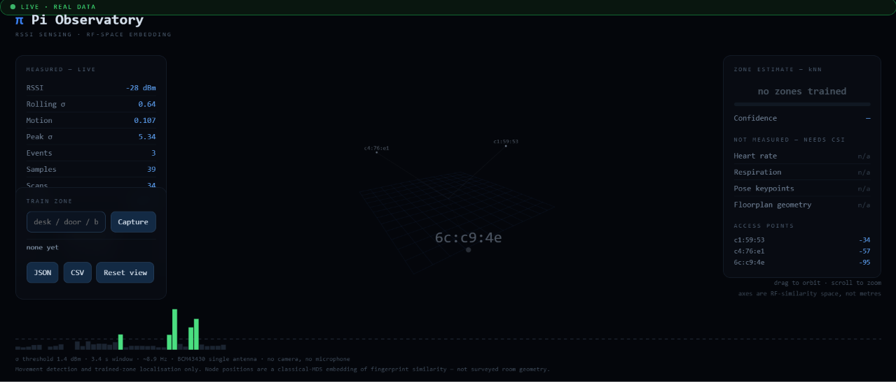
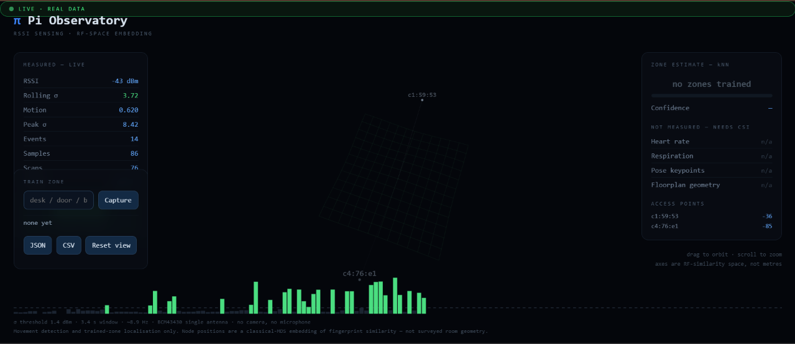
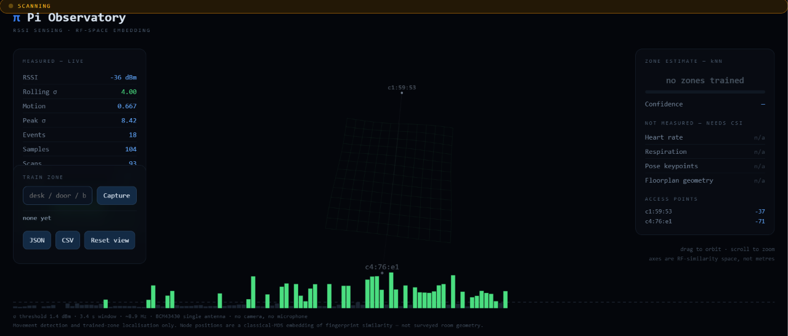
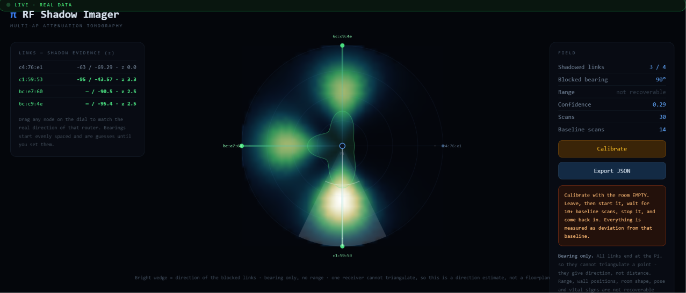

# Wi-Fi Presence Sensing on a Raspberry Pi 3B


*Movement detected - rolling standard deviation above the 1.4 dBm threshold*


*Empty room baseline*


*Trained zones in the MDS fingerprint embedding*


*Blocked-bearing estimate from multi-AP attenuation*

Detecting human movement and location from Wi-Fi signal strength alone — no
camera, no microphone, no extra sensors.

**Result:** median rolling σ of **0.51 dBm** for an empty room versus **2.91**
and **3.10** for continuous human movement — a **5.7–6.1×** separation with
**non-overlapping distributions**, against a threshold fixed before the trials
were run.

The more useful finding is methodological. Three separate experimental
confounds — USB undervoltage, insufficient device separation, and an open or
closed door — each produced convincing but wrong numbers before the real effect
was isolated. That story is in [`docs/STUDY.md`](docs/STUDY.md).

---

## What this measures, and what it does not

| Capability | Status |
|---|---|
| Movement detection | Working — 5.7–6.1× variance separation |
| Trained-zone localisation | Working — kNN over multi-AP fingerprints |
| Blocked-bearing estimation | Working — direction only |
| Range / distance | **Not recoverable** |
| Floorplan geometry | **Not recoverable** |
| Pose / body keypoints | **Not recoverable** |
| Breathing / heart rate | **Not recoverable** |

The bottom half of that table is not a to-do list. RSSI is a single scalar per
sample, from one antenna, with no phase and no time-of-flight. Those quantities
are not present in the measurement at all. They require Channel State
Information (CSI) — an ESP32-S3/C6 or a research NIC.

Every dashboard in this repository states its own limits on screen. That is
deliberate: a demo that displays fabricated vital signs next to real readings
teaches the viewer nothing about what the sensor can do.

---

## Hardware

| Component | Detail |
|---|---|
| Sensing device | Raspberry Pi 3B, BCM43430 Wi-Fi, single chip antenna |
| OS | Debian 13 (trixie), aarch64, kernel 6.18 |
| Python | 3.13 |
| Access point | Any Wi-Fi AP — a laptop hotspot works |
| Power | **Independent 5 V 2.5 A supply** — see below |

**Do not power the Pi from a laptop USB port.** A USB-A port supplies 0.5 A
against the Pi 3B's 2.5 A requirement; the radio browns out and the readings
become meaningless. It also tethers the Pi to within a cable length of the AP,
which removes the radio path a body would otherwise interrupt. This confound
produced a convincing false negative — see §3.1 of the study.

Verify with `vcgencmd get_throttled`. It must return `0x0`.

---

## Setup

```bash
sudo apt update
sudo apt install -y python3-venv python3-opencv python3-numpy libopenblas-dev
python3 -m venv --system-site-packages ~/ai
source ~/ai/bin/activate
pip install flask
```

Note: `libatlas-base-dev` was dropped in Debian Trixie in favour of OpenBLAS.
`--system-site-packages` lets the venv reuse the apt-installed numpy and
OpenCV rather than compiling them, which matters a great deal on a Pi 3B.

---

## Usage

### Collect data

```bash
sudo ~/ai/bin/python src/rssi_log.py empty 45     # leave the room
sudo ~/ai/bin/python src/rssi_log.py moving 45    # walk the Pi–AP path
python3 src/analyse.py rssi_empty.csv rssi_moving.csv
```

**Protocol matters more than duration.** Fix both devices in place, hold the
door state constant, and check that the mean received power matches between
conditions to within a couple of dB. If it doesn't, something structural
changed and the comparison is void regardless of how good the ratio looks.

### Run the dashboards

| App | Port | What it does |
|---|---|---|
| `apps/observatory.py` | 5003 | Live movement detection, event log, benchmark panel |
| `apps/mapper.py` | 5004 | Multi-AP fingerprinting, kNN zone localisation, export |
| `apps/observatory3d.py` | 5005 | Combined, with an orbitable 3D MDS embedding |
| `apps/imager.py` | 5006 | Radio shadow imaging — blocked-bearing estimation |

```bash
sudo ~/ai/bin/python apps/observatory3d.py
```

Then open `http://<pi-ip>:5005` from any device on the same network.

---

## Method

**Movement detection.** RSSI is sampled at ~8.9 Hz by polling `iw dev wlan0
link`. A background ping at 20 Hz keeps fresh frames arriving, because the
driver only refreshes RSSI on frame reception. The detection metric is standard
deviation over a 30-sample (~3.4 s) sliding window, thresholded at 1.4 dBm —
the midpoint between the measured empty-room maximum (1.02) and the moving p10
(1.79).

**Zone localisation.** Every visible access point is an independent
illuminator. `iw scan` returns signal strength from each, giving a feature
vector whose dimension equals the number of APs in range. Zones are trained by
capturing several scans in place; live position is classified by k-nearest
neighbour. Classical multidimensional scaling projects the fingerprint space
into 3D for display — so nodes that appear close together have similar radio
signatures, which is *not* the same as being physically close.

**Shadow imaging.** Each AP→Pi link attenuates when a body blocks it.
Comparing against an empty-room baseline gives a per-link z-score, and the
links are back-projected over their bearings to estimate blocker direction.

An earlier version of this attempted triangulation and was wrong: with a single
receiver, every link converges on the Pi, so the intersection is always the
receiver itself. Bearing is recoverable; range is not. A second receiver
elsewhere in the room would change that, and is the obvious next experiment.

---

## Repository layout

```
src/rssi_log.py        data collection
src/analyse.py         rolling-variance analysis
apps/                  four live dashboards
docs/STUDY.md          full write-up, including the failed trials
data/                  raw CSV traces
```

Failed and confounded trials are kept in `data/` deliberately. Every number in
the study can be reproduced by running `analyse.py` against these traces —
including the ones that misled me.

---

## Further work

- Second receiver node, enabling true tomographic localisation with range
- CSI capture via ESP32-S3 or ESP32-C6 (~₹600–900), which would make
  stationary-occupancy detection and respiration sensing possible
- Frequency-domain analysis in the 0.5–2 Hz gait band
- Replication of the clean baseline, currently a single 45 s run

## License

MIT
